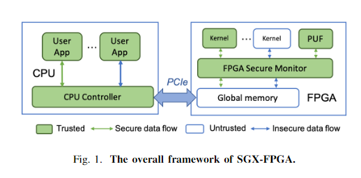
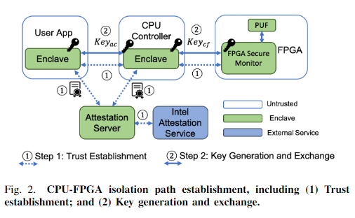
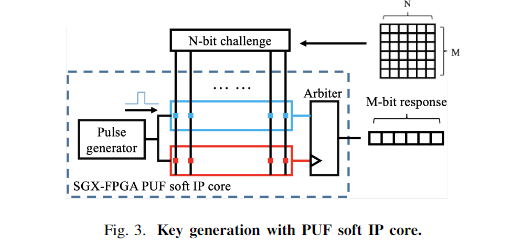

# abstract
TEE为CPU提供了有最小可信计算基以及攻击面的安全原语，但是不能支持FPGA，一些基于FPGA的云计算服务中的问题可以通过TEE解决，因此我们希望将TEE扩展到FPGA上。本文提出了SGX-FPGA，通过在FPGA-CPU架构上桥接SGX enclave和FPGA，本文实现了可信硬件隔离路径，并且是第一个FPGA TEE。
# introduction
为了能够利用FPGA的计算能力，很多厂家开始生产CPU-FPGA异构架构。比如说Xilinx以及Intel(CPU-FPGA片上系统(Xilinx Zynq SoC))。并且FPGA也被应用于商业的云计算系统上，比如Amazon AWS以及Microsoft Azure。

尽管有着性能优势，但是CPU-FPGA异构架构也面临着许多安全问题。比如，CPU侧的用户可能试图破坏FPGA侧数据的机密性和完整性，反之亦然。虽然有很多关于CPU以及FPGA各自的安全工作，但是对于两者之间的交互关注的却很少，因此在CPU-FPGA异构架构的发展和他的安全之间存在着巨大的鸿沟。

TEE能够创造一个沙盒，将操作系统隔离于可信计算基之外，因为操作系统的代码量比较大，很容易出现漏洞，所以这样做可以显著提高安全性。但是TEE只能用于CPU，对于CPU-FPGA这种异构架构不能直接使用。

虽然现在有很多GPU TEE，但是并不能用在FPGA上。GPU和FPGA的安全目标并不相同，因为GPU是一个完全由CPU控制的组件，在GPU TEE上被视为安全的，但是FPGA是一个独立的硬件加速器，并不受CPU控制，其中可能包括潜在的恶意IP盒。并且现存的加速器TEE需要复杂的硬件修改，没有在真实硬件上实现或者是评估，也不能抵御0-day攻击。

我们将CPU SGX的安全原语扩展到了FPGA上，简而言之就是在CPU和FPGA之间建立硬件隔离，从而保护在其中存储以及传输的敏感数据。具体来说，我们实现了一个安全协议，来验证CPU和FPGA双方，并保护其中传输的数据，从而将原来的CPU SGX扩展到FPGA enclave上。这里FPGA使用物理不可克隆函数作为可信根。我们的文章主要贡献在于：1、这是我们所知的第一个FPGA TEE；2、他首次解决了FPGA上不可信IP核的问题，不可信IP核可能会破坏CPU的信任根；3、本文提出的架构是非侵入式的，可以直接部署到FPGA开发板上，并且我们进行了真实环境下的测试，我们的架构有较高的安全性以及较低的性能开销。
# background

Intel SGX是Intel x86指令集的安全扩展，通过对虚拟容器enclave的隔离，来提供硬件安全增强。enclave里的代码和数据与不可信应用之间是隔离的，即便攻击者破坏了OS，enclave中的代码和数据的机密性和完整性也不会遭到破坏。但是SGX只能用于CPU中，不支持异构平台例如GPU或者FPGA。

目前已经有一些工作将SGX进行扩展，扩展到IO外设上、扩展到加速器上(这里的扩展必须进行很大的硬件修改，因此无法直接部署到现有的开发板上)、扩展到GPU上。由于GPU与FPGA本质上的不同，FPGA是独立于CPU的，并且存在不可信的IP核，因此可能会存在由FPGA到CPU的攻击，也就是下面threat model中FPGA to CPU。
# threat model

我们的工作是一个全新的领域，目前没有提出过类似的威胁模型。因为我们希望对CPU-FPGA异构架构整体进行威胁建模，所以我们提出如下三个原则：1、在CPU方面，我们只认为CPU硬件以及enclave是可信的，其他硬件以及软件组件都是不可信的。而在FPGA方面，与GPU TEE明显不同的是，我们需要认为FPGA以及PCIe总线是不可信的，可能存在恶意第三方IP以及总线探测攻击。2、因为这项工作是作为FPGA-TEE的试点工作，我们并没有超出CPU TEE很多，因此对于侧信道攻击以及硬件物理攻击不在我们的考虑范围之内。3、根据CPU-FPGA安全文献的分类，我们将CPU-FPGA系统的威胁分为以下四类：

CPU-CPU：恶意的用户可能会利用软件栈来攻击受害用户的应用。例如，恶意用户可能是特权用户，可以通过操作系统内核访问或修改受害用户的数据。

CPU-FPGA：CPU侧的用户可能会篡改CPU与FPGA之间共享内存的数据，并向FPGA注入故障，并且可能会探测PCIe总线上的数据。

FPGA-CPU：FPGA侧的攻击者可能会向FPGA上注入恶意IP，利用恶意IP访问或篡改CPU的数据以及PCIe总线上的数据。

FPGA-FPGA：
# proposed solution:SGX-FPGA

SGX-FPGA的安全部分主要包括四个组件：enclave内的用户应用，CPU侧的CPU控制器，FPGA侧的安全监视器，FPGA侧的物理不可克隆函数。用户应用要与FPGA进行通信时，首先将数据用与CPU控制器协商的密钥进行加密后传输到CPU控制器，控制器将数据解密后再用与PUF协商的密钥加密，并传输到FPGA安全监视器，FPGA SM通过管道与FPGA核进行通信。这样，通过共享内存和PCIe时的数据总是加密的，无论是不可信应用、OS还是监视器都无法访问数据。

用户想要跟FPGA通信时，首先需要向CPU controller验证自己是合法enclave中的可信实体，并通过ECDH与CPU controller协商一个通信密钥。接着CPU controller向FPGA PUF发送一个挑战，接受PUF返回的响应，通过预先定义的挑战-响应对，验证该PUF是否为可信实体。一旦验证成功，PUF会向CPU controller和FPGA SM发送一个生成的密钥，用于第二轮的通信。这样就建立起了一个隔离的通信信道。

## A、CPU-FPGA隔离路径的建立

建立隔离路径需要分为两步：CPU-FPGA两者相互认证以及两者生成用于通信的密钥。这两部实质上就是将CPU TEE扩展到了FPGA上。
### CPU、FPGA信任建立

SGX-FPGA采用可以在CPU和FPGA之间建立相互信任的验证机制，以保证一方确定与真实的另一方进行通信，防止攻击者创造一个恶意的实体(CPU应用或者是FPGA IP核)的复制。根据CPU和FPGA是否存在于相同的平台上，又将验证过程分为本地验证和远程验证。
#### 本地认证
首先CPU中的用户应用程序和CPU controller两者都有自己的enclave，并且可以通过SGX中原有的认证机制进行相互的认证。然后是CPU controller和FPGA PUF之间的认证，CPU controller会维持一个预先选定的挑战响应表，与特定FPGA的PUF对应。CPU controller从中选择一个随机的挑战通过PCIe发送给FPUA SM，并转发到PUF，并接收返回的响应，如果与表中对应，则信任建立。
#### 远程验证
在用户应用和CPU controller不在同一个平台上的情况，两者会向选定的远程认证提供者进行验证，验证通过后，server会向对应实体发送彼此的包括必要组件(enclave ID)的证书，然后app和controller通过交换以及验证彼此的证书来建立信任。
在验证完成后，需要生成在PCIe总线上进行会话的会话密钥，会话密钥包括app和controller进行会话的 $Key_{ac}$以及controller和PUF会话的$Key_{cf}$。

在app和controller进行验证过程中，会交换彼此的报告，报告中同时也会包括基于ECDH生成的进行会话的密钥。$Key_{ac}$会被存储在enclave中，不会被不可信应用访问。

### 安全的CPU-FPGA通信
controller与SM进行相互验证后，会由PUF生成$Key_{cf}$并通过ECDH公钥交给controller以及SM。通过PUF生成$Key_{cf}$可以减少密钥存储和生成过程中的性能消耗，因为PUF本身就包含一个很大的CPR数据库。$Key_{cf}$的安全性由PUF的唯一性和随机性进行保证，$Key_{ac}$由SGX随机数生成器保证。使用基于hash的密钥生成算法也可以进一步增加密钥的熵。

从安全性的角度出发，app和controller之间进行加密传输可以防止CPU-CPU攻击，而controller和SM之间加密传输可以防止CPU-FPGA以及FPGA-CPU攻击。

### 基于PUF的硬件可信根
在我们设计的SGX-FPGA中，我们使用PUF来生成 $Key_{cf}$，具体来说，为了生成最大数量的密钥，我们使用Arbiter PUF来生成。Arbiter PUF由两个延迟链组成，每个延迟链包括多个级联的多路选择器。这些多路选择器的选择信号是PUF的输入，也就是挑战；相应的输出被称为响应。对任意的Arbiter PUF，输入Nbit，输出为$2^N$。
#### PUF设计和实现

挑战响应对被预先存储到enclave中，为了用于FPGA的验证和密钥生成。为了PUF对现代FPGA的可重用，我们将Arbiter PUF作为IP核设计，可以直接使用vivado调用。

我们使用的7系列FPGA的基本可编程组件是6输入LUT(LUT6)，Arbiter PUF中的每个MUX都是由LUT实现的。不像ASCI，FPGA中的延迟链可能出现偏差，并且可以全0或全1；为了缓解这个问题，我们将实现MUX的LUT所有引脚全部使用。具体来说，LUT的6个输入引脚分别用于挑战比特($C_i$)和MUX的两个输入$I_i$，剩下的三个引脚全部用于微调。也就是说，MUX被设计为可编程延迟链。在实际使用中，三个微调引脚都进行重配置使得输出结果为0和1的概率分别为50%。

#### 密钥方案
PUF RTL作为密钥生成器，是由硬件组件以及辅助通信接口的本地信息组成，利用CMOS晶体管的微观变化过程以及PUF的硬件组件的位置，决定了他的唯一性等特点。在实际上每个FPGA芯片包括多个PUF实例，每个PUF都包括自己唯一的CRP数据集。基于这个特点，我们提出了两个云服务器提供商和FPGA供应商的注册方法：1、云服务器提供商注册：云服务器提供商采用可信证书颁发机构在FPGA和CPU之间办法公钥/私钥对。只有拥有私钥的可信用户才能够获得PUF的CPR。2、可信设备提供商注册：为了验证FPGA，FPGA制造商可以为特定的PUF创建PUF CPR模型，并在SGX中注册这个模型。只有经过注册的PUF才可以与SGX进行隔离通信。

# experiment results
# conclusion
我们设计了SGX-FPGA，一种通过从CPU TEE根据可信硬件隔离路径的FPGA TEE，这种方法确保了异构CPU-FPGA的完整性和可信性。SGX-FPGA通过CPU controller和FPGA SM实现安全目标，这两个实体之间可以相互验证，并且利用预先建立的密钥进行数据加密。我们在真实硬件上实现，并且例证高安全性和低功耗。SGX-FPGA是非侵入性的，能够直接部署到商用FPGA和SGX系统上。
